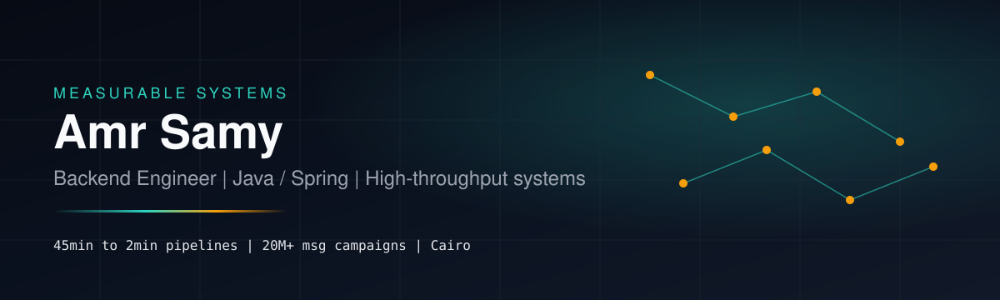

# Hi, I'm Amr Samy 👋

<p align="center">
  
</p>

<p align="center">
  
</p>

<p align="center">
  <a href="mailto:samyamr270@gmail.com"></a>
  <a href="https://www.linkedin.com/in/amr-samy-2851ab13b"></a>
  <a href="https://github.com/amrsamy203/measurable-systems"></a>
  
</p>

<p align="center">
  <b>I turn slow, fragile business processes into fast, reliable pipelines</b><br/>
  <sub>Queues · rules · integrations · APIs that hold up under real volume</sub>
</p>

---

## Impact at a glance

<p align="center">
  
  
  
  
</p>

<table>
<tr>
<td width="50%">

### Who I am
Software Engineer (Backend) based in **Cairo**.  
B.Sc. CS — **Cairo University**.  

I build systems where **latency, volume, and failure modes** matter — fintech AML pipelines, telecom campaign engines, AI product features, and multi-cloud data services.

</td>
<td width="50%">

### What clients hire me for
- Spring Boot **APIs & workers**
- **RabbitMQ** queues, routing, DLQ
- High-volume **integrations**
- Batch / concurrency **performance**
- AI features as **backend endpoints**

</td>
</tr>
</table>

---

## Featured work — [Measurable Systems](https://github.com/amrsamy203/measurable-systems)

> Every demo ships with a **Throughput Console**, architecture notes, and failure injection — so you can *see* how the system behaves.

<p align="center">
  <a href="https://github.com/amrsamy203/measurable-systems"></a>
</p>

<table>
  <tr>
    <td width="33%" valign="top">
      <h3 align="center"><a href="https://github.com/amrsamy203/measurable-systems/tree/main/projects/caseflow">CaseFlow</a></h3>
      <p align="center"></p>
      <p>Fair <b>case routing</b> under load: ingest → rules → queues → round-robin assign · SLA · audit.</p>
      <p><code>Spring</code> · <code>Postgres</code> · <code>RabbitMQ</code> · <code>JWT</code></p>
    </td>
    <td width="33%" valign="top">
      <h3 align="center"><a href="https://github.com/amrsamy203/measurable-systems/tree/main/projects/dispatchgrid">DispatchGrid</a></h3>
      <p align="center"></p>
      <p>Multi-provider <b>campaign dispatch</b> with rate limits, outbox, retries, and DLQ.</p>
      <p><code>Spring</code> · <code>Outbox</code> · <code>API keys</code> · <code>Fake providers</code></p>
    </td>
    <td width="33%" valign="top">
      <h3 align="center"><a href="https://github.com/amrsamy203/measurable-systems/tree/main/projects/relateai">RelateAI</a></h3>
      <p align="center"></p>
      <p>Social/topic <b>graph insights</b> + daily AI challenges + media uploads.</p>
      <p><code>Spring</code> · <code>Graph APIs</code> · <code>OpenAI/mock</code></p>
    </td>
  </tr>
</table>

```bash
git clone https://github.com/amrsamy203/measurable-systems.git
cd measurable-systems && docker compose up --build -d
# Portfolio :3000 · CaseFlow :8081 · DispatchGrid :8082 · RelateAI :8083
```

---

## Career timeline

```text
2025 ──●── Cyshield ........ Multi-cloud microservices (Java/C/C++/Rust · AWS/Azure/GCP)
2024 ──●── bub AI ........... OpenAI challenges · graph DB · Azure Blob
2023 ──●── Data Gear ........ AML · AGP 45min→2min · RabbitMQ routing
2020 ──●── Smart Link ....... Telecom VAS · 20M+ SMS campaigns · .NET
2015 ──●── Cairo University . B.Sc. Computer Science
```

<details>
<summary><b>Full experience details (from resume)</b></summary>

<br/>

### Software Engineer — Cyshield, Egypt · `Jul 2025 – Present`
Backend microservices in Java, C, C++, Rust · AWS / Azure / GCP (IAM, DynamoDB, Kinesis, SNS) · DynamoDB, FoundationDB, GCP stores · WebRTC research · confidential computing (OpenEnclave, SGX).

### Backend Engineering — Data Gear, Egypt · `Jan 2023 – Jun 2025`
AML apps (Java/Spring) · AGP optimization **~45 min → ~2 min** · concurrency · alarm/case/suspect queues · round-robin routing · Oracle, RabbitMQ, Jenkins, Docker.

### Backend Engineering — bub AI, Singapore · `Jan 2024 – Dec 2024`
OpenAI daily challenges · graph analysis of connections/topics · Azure Blob uploads · Spring Boot, MongoDB.

### Backend Engineering — Smart Link, Egypt · `Oct 2020 – Oct 2021`
Telecom VAS (.NET) · **20M+ SMS**/campaign · shopping + payments · SOAP/REST, Worker Services.

</details>

---

## Tech stack

<p align="center">
  
</p>

<p align="center">
  
  
  
  
  
  
  
</p>

---

## Education & competitive programming

<table>
<tr>
<td width="50%" valign="top">

### Education
**B.Sc. Computer Science**  
Cairo University · 2015–2020  

DS/Algorithms · OOP · OS · AI

</td>
<td width="50%" valign="top">

### Contests & coaching
ECPC finals **×3**  
Local CU qualifier **3rd**  
ECPC Co-coach **×2**  
Instructor — ICPC Cairo Science

</td>
</tr>
</table>

<details>
<summary><b>Graduation project</b></summary>

<br/>

**Handwritten Mathematical Expression Recognition** → LaTeX  
Segmentation **90.87%** · hybrid classifier **80.62%** (offline RF + online stroke model).

</details>

---

## GitHub analytics

<p align="center">
  
  
</p>

<p align="center">
  
</p>

<p align="center">
  
</p>

<p align="center">
  <a href="https://github.com/amrsamy203/measurable-systems">
    
  </a>
</p>

---

## Let's build something reliable

Open to **Upwork · Freelancer · Khamsat** — Spring Boot APIs, queue workers, integrations, batch optimization.

<p align="center">
  <a href="mailto:samyamr270@gmail.com"></a>
  <a href="https://www.linkedin.com/in/amr-samy-2851ab13b"></a>
  <a href="https://github.com/amrsamy203/measurable-systems"></a>
</p>

**Phone:** +20 101 653 0911

<details>
<summary><b>How I start an engagement</b></summary>

<br/>

1. Echo the business problem in plain language  
2. Propose a fixed first milestone  
3. Deliver runnable software + short decision notes — not only a code dump  

</details>

---

<p align="center">
  
</p>

<p align="center">
  <sub>Designed around the <b>Measurable Systems</b> brand — industrial precision, real metrics, production-minded backends.</sub>
</p>
